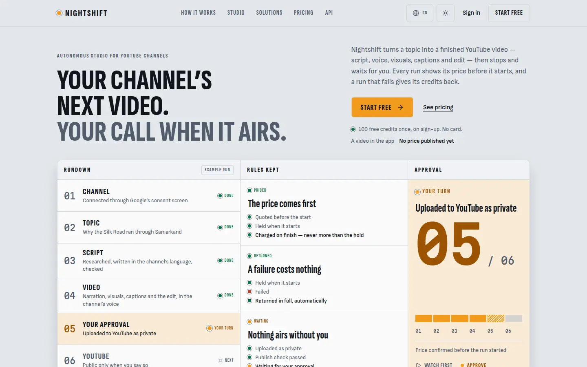
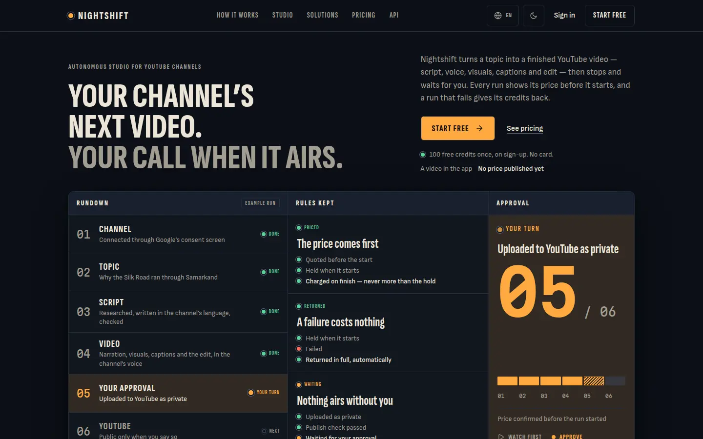
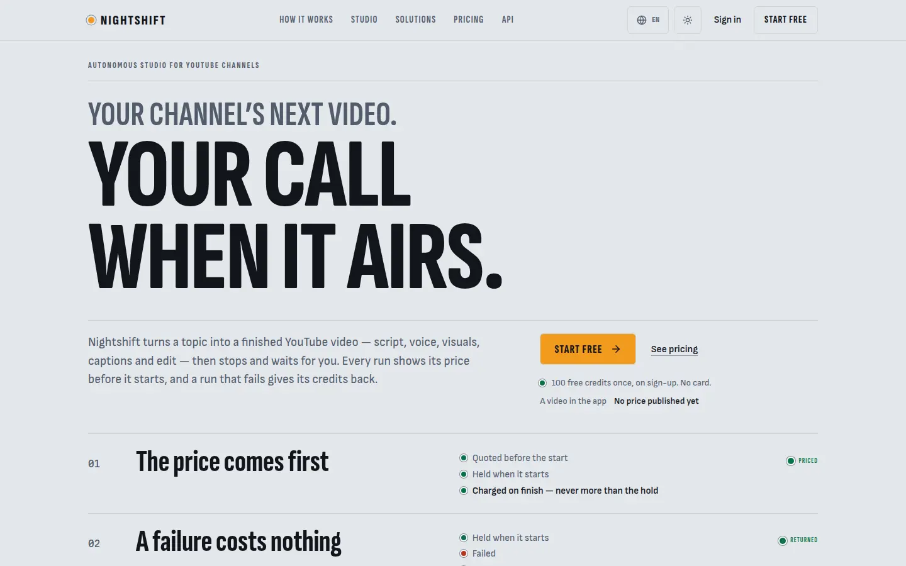
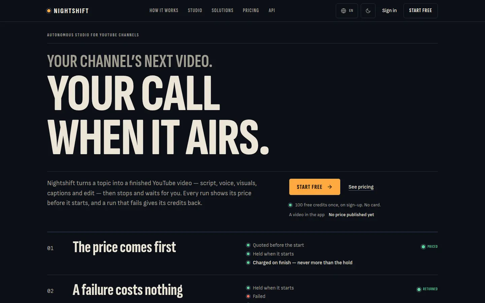
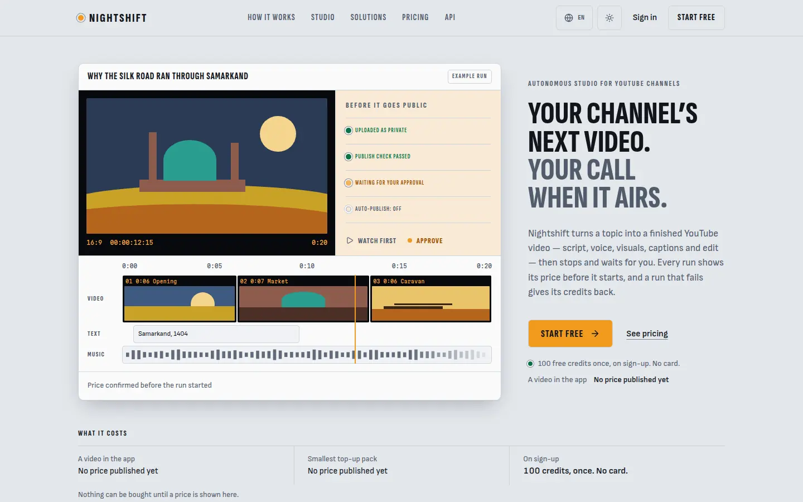
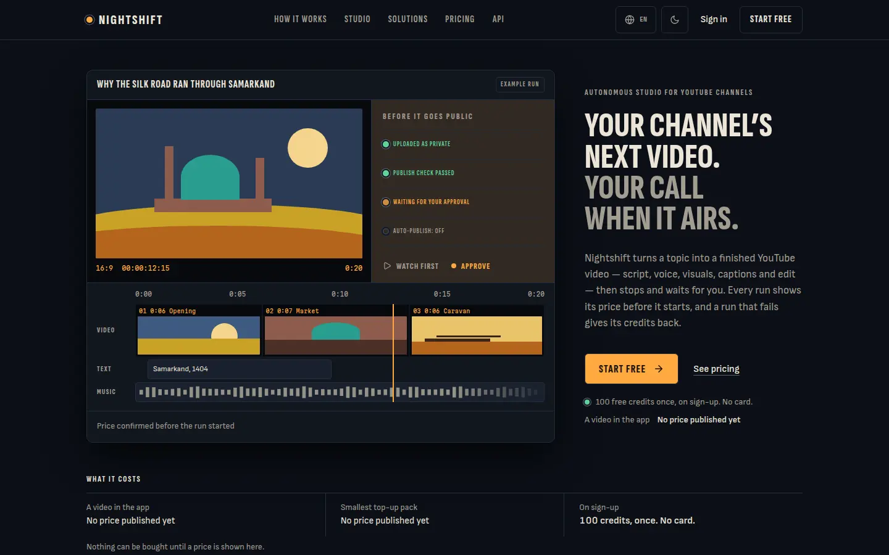

# Atelier concept stage: three hero compositions for the public landing

Status: concept, 2026-10-02. Prototypes, not the live page. Nothing here is
merged into `/`, `/pricing` or any public route. An independent scorer picks
the winner; only then is one composition applied.

Why this stage exists: the landing scored 92.5 / 94.5 (PIXEL-5) by being
correct. The next points are not in the fixes list; they are in whether the
first screen is one bold, specific idea. So before polishing, three genuinely
different heroes were built as real pages (same tokens, type, lamps, keys,
motion kit, copy and i18n as the live site), photographed, and measured.

## 1. How to look at them

```
cd command-center
ATELIER_CONCEPTS=1 npx next build && ATELIER_CONCEPTS=1 npx next start -p 3821
# /atelier/a  /atelier/b  /atelier/c   (add ?bare=1 to drop the prototype strip)
# language: the usual chronos_locale cookie; theme: the usual toggle
```

The flag is a server variable read per request (`lib/concepts.ts`), so the same
build answers 404 without it. Run without it to see the 404.

### What keeps them off the site, and what does not

Setting `ATELIER_CONCEPTS=1` makes the three pages **public but unlisted, not
private**: anyone who can reach the deploy and knows the URL can open them, with
no sign-in, and they read the same two public price lists as the landing.
`noindex` and the absence from the sitemap only keep them out of search and out
of the listing. Leave the variable unset on a production deploy unless that is
what you want; the deploy template says so.


| Rule | Where | Pinned by |
| :-- | :-- | :-- |
| Flag is the literal `ATELIER_CONCEPTS=1`; never `NEXT_PUBLIC_`; unset, `true`, ` 1` are off | `lib/concepts.ts` | `tests/atelier-concepts.test.ts` |
| Off: every path under `/atelier` is the public 404 (rewrite to `/_not-found`, status 404), signed in or out, backend or not. Not a sign-in redirect | `middleware.ts` (new branch at the top of `gate()`) | same, middleware cases |
| On: exactly `/atelier/a`, `/atelier/b`, `/atelier/c` (trailing slash ok) are served, with `X-Robots-Tag: noindex, nofollow`; `/atelier`, `/atelier/d`, `/atelier/a/x`, `/atelier/%61`, `/ATELIER/a` stay 404 | `conceptDecision()` | same |
| The page checks the flag itself, before it reads anything, and is `force-dynamic` with `robots: noindex, nofollow, nocache` | `app/(concepts)/atelier/[variant]/page.tsx` | source pin + live check |
| Not in `PUBLIC_PATHS`, `ALWAYS_PUBLIC_PATHS`, `SITEMAP_PATHS`, the sitemap output or `robots.txt` (a robots line would publish the path; none is added) | `lib/public-paths.ts`, `app/sitemap.ts`, `app/robots.ts` untouched | same |
| `atelier` is a reserved root segment (no customer channel can be called that; BR-L-160), pinned in `tests/atelier-reserved.test.ts` | `lib/public-paths.ts` `RESERVED_ROOT_SEGMENTS` | same |
| BR-H-001 is untouched: the `config.matcher` string is unchanged, `gateDecision("/atelier/a", false)` is still `to-login`, `isPublicPath` is still false | `middleware.ts` matcher, `lib/public-paths.ts` | same, plus `tests/middleware-matcher.test.ts` and `tests/public-paths.test.ts` still green |

Checked on a production build: flag on, `/atelier/{a,b,c}` 200 with
`x-robots-tag: noindex, nofollow` and `<meta name="robots" content="noindex,
nofollow, nocache">`; the same build without the flag answers 404 on all
three; `/atelier`, `/atelier/d`, `/atelier/a/x` 404 either way; `sitemap.xml`
and `robots.txt` contain no `atelier`.

Deploy plumbing: the repo's own tests require every env var the app reads to be in
`deploy/.env.web.example` and mapped in `.github/workflows/deploy_web.yml`, so
`ATELIER_CONCEPTS=` (empty, with a "leave empty on every real deploy" note) and
`WEBENV_ATELIER_CONCEPTS: ${{ vars.ATELIER_CONCEPTS }}` are added. Empty is off;
no repository variable by that name exists unless the owner creates one.

Cost of the prototype to production: one extra 7.6 kB route chunk that only
`/atelier/*` loads, and one `conceptDecision()` call at the top of the
middleware (a string split and compare).

## 2. The three ideas

All three keep the identity ("Master control, 03:00"): Sofia Sans Extra
Condensed / Sofia Sans / Martian Mono, the amber key as the only lit action,
lamps with words beside them, radius by role, no gradients, no glow, no
emoji, no accent bars, no centred hero. All three keep the truth rules: every
sentence is the live page's own (`t.site.*`, en / ru / uz), the only figures
are the welcome grant and whatever the price list holds, no testimonials,
logos, counts or vendor names, price first, nothing airs without approval.
Each also puts one line of price directly under the sign-up key ("A video in
the app: 100 credits a minute", or, with nothing published, "No price
published yet") and the three-fact price row under the hero.

### A. The rack (`/atelier/a`)




**Idea.** The control room itself, drawn as one instrument cluster as wide as
the page: three modules in one rack. Rundown (six cues, a lamp each), Rules kept
(the three rules, each with the lines of its ledger), Approval (the one lit
lamp, a large `05 / 06` position counter in the counter face, a six-step
ladder, the price confirmation, the Approve legend). The headline is
deliberately smaller than the live page's: here the picture is the claim.

**Rationale.** It is the most literal form of the concept and the most
product-true: a visitor sees the rundown, the three guarantees and the waiting
approval at once. It reuses the most existing parts (`StatusLamp`, `Meter`,
`st-num`, the rundown copy), so it is the cheapest to build and the closest to
the current page, which makes it the safe choice and the least surprising.

**Motion.** The cluster prints once in reading order on first paint (Stagger,
MOTION.md 5.1); one lamp breathes (the approval module's). Headline, lead and
key are plain HTML.

**Truth notes.** The ladder counts steps (four of six done, the fifth
waiting), not credits, so no balance is invented. `05 / 06` is the example
run's step. Labelled "Example run".

**Tradeoffs.**
- Closest to the live hero, so least distinct: it is the same idea at four
  times the size. It risks reading as "a dashboard", which is the sameness the
  rubric warns against.
- Densest: 3,108 px tall on a phone (the rule lines are hidden below 640 px to
  contain it). The Rules section becomes redundant and would be removed.
- The large amber-tinted approval module is a lot of amber for "one lit thing",
  especially on paper.

### B. The ledger (`/atelier/b`)




**Idea.** No machine and no screenshot. One editorial statement set at the
width of the page ("Your channel's next video." small, "Your call when it
airs." at about 155 px) and under it the three promises written as ledger
entries: a number, the rule in display type, its lines as journal entries with
a lamp each, the state it stands in. A 2 px ink rule opens the ledger; the
approval entry closes on an ink rule. The ledger is the hero image.

**Rationale.** It is the boldest idea and the cheapest in bytes, and it
expresses "price first, nothing without you" as typography rather than a
picture of a UI. It also makes the product's accounting metaphor (quote, hold,
charge, return) the visual language, which is ownable.

**Motion.** The three entries print in order once; the waiting lamp breathes.
The statement and the key never animate.

**Truth notes.** Nothing drawn at all, so nothing to caveat.

**Tradeoffs.**
- No product proof in the first view. Rubric 3 asks for "real product states,
  not stock"; this has copy only. A reader who wants to see the product has to
  scroll to a later section.
- At 1440 the top-right of the first frame is empty by design; some will read
  it as unfinished, not as editorial space. A very large condensed uppercase
  headline is also a familiar move; the ledger below it is what makes it ours.
- It absorbs the Rules section (the same three promises said twice would be
  filler).
- Long Russian and Uzbek lines wrap the statement to two lines at a smaller size.

### C. The screen waiting (`/atelier/c`)




**Idea.** The hero is the moment the product exists for: a finished video on
its own screen, drawn large. A player with a drawn frame; beside it the verdicts
the video waits on (uploaded as private, publish check passed, waiting for your
approval, auto-publish off) and the Approve legend; under it a drawn timeline
(ruler, three clips on film with edge print, a text track, a music track) with
the amber playhead crossing all three. The headline is the caption of the
screen, set to the right of it (the picture comes first on a wide screen, the
headline first in the document and on a phone).

**Rationale.** It shows the one thing nothing else sells: you approve before
anything goes public. It carries real product states without a stock image, and
the timeline is the one illustration only a video tool has. It lets the Studio
and How sections stop repeating a screenshot.

**Motion.** The three clips print in order and the playhead travels in from
the start once (a transform on a wrapper, `components/concepts/Playhead.tsx`);
the waiting lamp breathes. Reduced motion, no script or a failed engine: the
complete still screen.

**Truth notes.** An illustration, labelled "Example run" and described in full
to assistive technology. The scenes are flat shapes, not generated pictures.
The 20 s length, the clip lengths and the timecode are an example, as in the
Studio section's editor picture. The topic is the live page's sample topic.
Nothing in it can be pressed.

**Tradeoffs.**
- It duplicates two things the live page already draws further down (the
  step-05 screenshot in How and the editor timeline in Studio). Adopting it
  means changing those two sections so one picture is not said three times.
- The drawn frame is a placeholder for real frames (see section 4); flat
  shapes carry the identity but not the "finished video" feeling a real frame
  would.
- The headline column is narrow at 1440, so the statement is four short lines.

## 3. Evidence (production build, flag on, real Chromium)

Screenshots are in `docs/design/atelier/` (21 webp, 1.2 MB): per variant 1440
light and dark, 390 light and dark (full page), 1440 ru, 390 uz, and 1440
light with the price list filled. The full-size PNGs and the capture scripts
(adapted from the PIXEL-5 ones) are kept with the review notes, not in this
repository.

Builds: unpriced and without a backend (the owner's current state) for every
number below, and one priced build (display prices `$10 / $45 / $160` baked in
and a scratch fake backend answering `public_video_rates()` with 100 credits a
minute and a 20-credit minimum, and `api_prices`) for the priced shots only.
The scratch numbers are test fixtures, not prices.

| Measure | A | B | C |
| :-- | :-- | :-- | :-- |
| Captures (1440 and 390, light and dark, en; ru and uz sanity) | 8 | 8 | 8 |
| axe 4.13, wcag2a/aa/21aa/22aa + best-practice: violations | **0** | **0** | **0** |
| Horizontal overflow (scrollWidth - clientWidth), max | 0 | 0 | 0 |
| CLS, max | 0 | 0 | 0 |
| Tap targets under 44 px | 0 | 0 | 0 |
| LCP, unthrottled, range | 160-360 ms | 140-232 ms | 136-224 ms |
| LCP, phone, 150 ms / 1.6 Mbps / 4x CPU | 1.29 s | 1.25 s | 1.26 s |
| JS on the phone load (live landing: 119 kB) | 153 kB | 153 kB | 153 kB |
| Page height at 1440 / 390 | 1,556 / 3,108 | 1,702 / 2,397 | 1,370 / 2,547 |
| Sign-up key bottom edge in the first frame, 1440 / 390 (viewport 900 / 844) | 288-315 / 497-541 | 416-580 / 549-559 | 593-623 / 497-540 |
| Reduced motion: animations over 20 ms, kit elements not at rest | 0 / 0 | 0 / 0 | 0 / 0 |
| After load: animations still running | 1 lamp | 1 lamp | 1 lamp |
| No JavaScript: nothing left invisible (the theme key, which needs script, is blank) | yes | yes | yes |

The first run found two real defects, both fixed before these numbers: B's
tinted approval row put its amber label at 4.2:1 on the tint (removed the tint),
and C's drawn dunes extended below their frame, which axe read as a 1.55:1
background under the ruler labels (clipped to the frame). A third cleanup:
A had two lamps breathing at once; now one does.

Cost to know about: all three carry the motion engine (the live landing has no
`MotionProvider`), so +34 kB of JavaScript on the phone load, and throttled LCP
is still no worse than the live page's 1.48 to 1.59 s because the headline,
lead and key are plain HTML and the entrance never waits on script. If the
chosen hero keeps an entrance, that +34 kB is its price; MOTION.md 5.1 already
says a CSS stagger does the same for 0 kB.

ru and uz: all three render with the live page's own Russian and Uzbek copy
(the hero, rundown, rules and anchor strings), and the few new strings (the illustrations' descriptions and three module
heads) are in `lib/i18n/site/concepts.ts` in all three languages. Russian and Uzbek wrap
the headline to more lines and the type steps down (rules in `concepts.css`);
no overflow, no clipping (0 overflow, 0 axe in all 12 ru/uz captures). The ru
and uz wording of the new strings is mine, not a native speaker's.

## 4. What real visual material each would need, and the budget questions

Nothing was bought, generated or licensed. Everything above is drawn in
HTML and CSS, so all three ship at zero asset cost today. Real material is an
upgrade, and it is an owner decision because it costs money or credits.

| | Needs to ship | Would improve it | Cost type |
| :-- | :-- | :-- | :-- |
| **A** | Nothing | A short looped screen recording of the real rundown running on sample data (free, from our own app) shown in place of the static cluster, played only on hover or focus and never under reduced motion; a drawn engraving set for the module heads (in-house or one commissioned designer, a day or two) | none / small fixed fee |
| **B** | Nothing | Possibly a commissioned type-and-rule specimen or paper texture, which the identity does not want (no mood textures); realistically nothing | none |
| **C** | Nothing (flat drawn scenes) | Real frames: either 3 to 6 flat illustrations in the same palette from a commissioned illustrator, or real frames from a finished Nightshift sample video (generating one spends provider credits, the thing the rules say never to do without a priced press) or licensed footage; plus a real screen recording of the approval flow (free) | fixed commission, or credits, or licence |
| Any | | A 3D or video hero (a console rendered, a looping clip) is not recommended: it fights "solid, engraved, nothing floats" and costs LCP | commission + weight |

Questions for the owner, in order of how much they change the pick:

1. Is a one-off illustration or footage budget available at all for the
   landing? If no, C's frames stay drawn and the choice is free of this.
2. If yes, a fixed commission (one illustrator, three to six flat frames, a
   named price and usage rights) or credits to render one real sample video?
   The first is predictable; the second needs a spend limit and your explicit
   press, like every other run.
3. Must a hero image be of a real channel's real video? If so it needs the
   channel owner's written permission and counts as a testimonial under the
   truth rules; a labelled sample made by us does not.
4. Is a screen recording of the actual app (sample data, labelled) acceptable
   as proof? It is free and the most truthful material available.
5. Is the extra 34 kB of JavaScript for a one-second entrance worth it, or
   should the entrance be CSS only?
6. Who owns the final ru and uz wording of any new sentence?

## 5. Recommendation (mine; the independent scorer decides)

**Home: C. Spread the other two by page.**

- C is the only one whose picture is a claim no competitor page can make
  without the product behind it: you approve before it airs. It carries real
  product states without stock, it is the strongest on rubric criterion 3
  ("proof: real product states") and 1 (one bold idea in one place), and it
  keeps B's discipline of one lit key. It is also where "nothing airs without
  you" is easiest to believe.
- A is the safe pick and the weakest on distinctness. Its best part, the large
  `05 / 06` counter in the counter face, is worth keeping as a device.
- B is the boldest and the cheapest, and the weakest on proof. As a home hero it
  would need a product picture straight below it; as a page of its own it is
  the best fit anywhere money is the subject.

Per-page distinct approach, home first and then the spread:

| Page | Idea | Why |
| :-- | :-- | :-- |
| `/` | C, the screen waiting | The product's moment; absorbs How's screenshot and the Studio timeline duplication |
| `/pricing` | B, the ledger | The page is about quote, hold, charge, return; the ledger is already its metaphor |
| `/solutions/developers` and `/docs/api` | A, the rack (as an API console: calls, a price per call, one lit state) | Instruments suit people who read specs |
| `/solutions/youtube-channels`, `/solutions/creative-studio` | C's frame, re-cast (a channel desk, a studio timeline) | One drawn object each, not three card grids |

What I would change before applying C: let the player frame be a labelled
real frame once the owner answers question 1; remove or re-cast the How
screenshot and the Studio editor picture so the page does not show the same
screen three times; and decide on the entrance (question 5).

## 6. What was not verified

- Safari, iOS and Firefox: Chromium only (the same limit as PIXEL-5).
- A real backend: the priced shots use a scratch fake; real price rows,
  Paddle previews and the plan catalog were not exercised (the concepts read
  only the two public price reads the landing already uses).
- Real devices, real network: LCP is Chromium's own throttling.
- Whether the ru and uz sentences read naturally to a native speaker.
- That a visitor reads a hero this way: no user test, no analytics. The three
  are judged by rubric and eye, not by conversion.
- Contrast of the drawn scene colours: they are picture content (hard-coded
  hex, as in the live editor picture), exempt from the token system and not
  tested.
